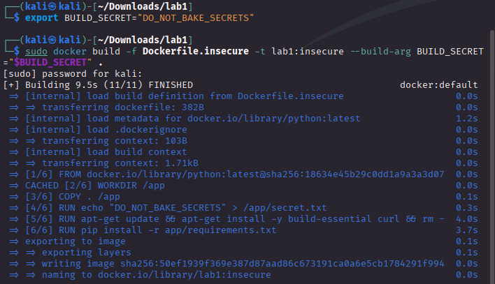
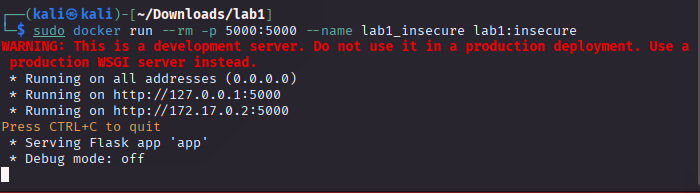
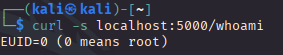
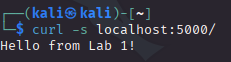
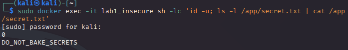

# Lab 1 — Insecure Dockerfile… and a Proper Fix

> **Goal.** Learn to recognize common insecure Dockerfile patterns, measure their impact (size, privileges, leakage), and then refactor the image to a safer, production‑ready build. This lab is split into two parts: **(A) Challenge**(this file) and **(B) Guided Solution** ([Click here for Solution](./lab1_solution.md)).

*For Lab solution, check out [lab1_solution.md](./lab1_solution.md)!*
---

## Prerequisites
- A machine with **Docker** (or any OCI‑compatible engine) installed and running.  
- A terminal and a code editor.  
- Optional tools for extra practice (not required):  
  - **Hadolint** (Dockerfile linter).  
  - **Trivy** (image vulnerability scanner) *or* **Docker Scout**.  

>[!IMPORTANT]
>
> Everything runs locally; no cloud account needed.

---

## Repository layout used in this lab
You’ll [download and unzip this zip archive](./lab1.zip). The zip archive contains the following files:
```
lab1/
├─ app/
│  ├─ app.py
│  └─ requirements.txt
├─ Dockerfile.insecure
├─ Dockerfile  //the fixed version you’ll build later!
└─ .dockerignore
```

---

# Part A 

### A1. Build and run the insecure image
```bash
cd lab1
```
```bash
export BUILD_SECRET="DO_NOT_BAKE_SECRETS"
```
```bash
sudo docker build -f Dockerfile.insecure -t lab1:insecure --build-arg BUILD_SECRET="$BUILD_SECRET" .
```



```bash
sudo docker run --rm -p 5000:5000 --name lab1_insecure lab1:insecure
```



Open another terminal and inspect:

- Check privilege


```bash
curl -s localhost:5000/whoami
```



- Check the app works

```bash
curl -s localhost:5000/
```



Open a shell into the running container and look for the baked secret:
```bash
sudo docker exec -it lab1_insecure sh -lc 'id -u; ls -l /app/secret.txt | cat /app/secret.txt'
```



Stop the container when done (Ctrl+C in the first terminal).

### A3. Observe the problems
- Image uses **`python:latest`** → non‑deterministic builds; may pull vulnerable base.  
- **Root** user by default → bigger blast radius on compromise.  
- **Secret baked** via `ARG` → permanently stored in an image layer and any pushed registry.  
- **Huge attack surface**: extra packages, dev server, unpinned pip deps.  
- **COPY .** without a well‑tuned `.dockerignore` can leak files into the image.  


### A4. Your task
1. **Refactor** the image to follow best practices:
   - Use a **minimal, pinned** base image.
   - Use a **multi‑stage build** to keep build tools out of the runtime image.
   - Run the app as a **non‑root** user and on a non‑privileged port.
   - Do **not** bake secrets at build time; pass them only at **runtime** as env vars.
   - Add a simple **HEALTHCHECK**.
   - Keep the final image small (compare sizes before/after).
2. Prove it works:
   - App responds on the chosen port.
   - `whoami` shows non‑root.
   - `/secret-demo` is `False` by default, and `True` only when you pass `-e SECRET_VALUE=...` at **runtime**.

> *When you’re ready (or if you get stuck), proceed to **[Part B](./lab1_solution.md)** for a guided solution.*

---
