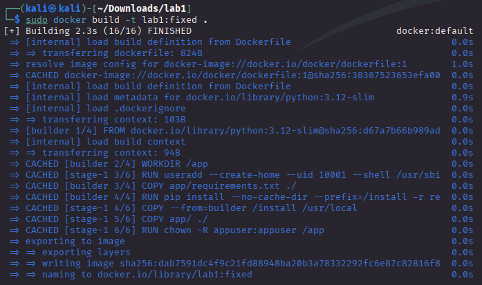
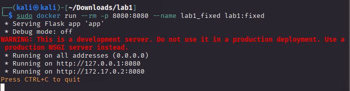
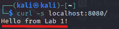
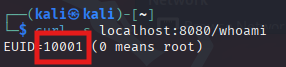
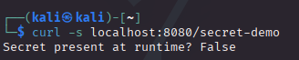
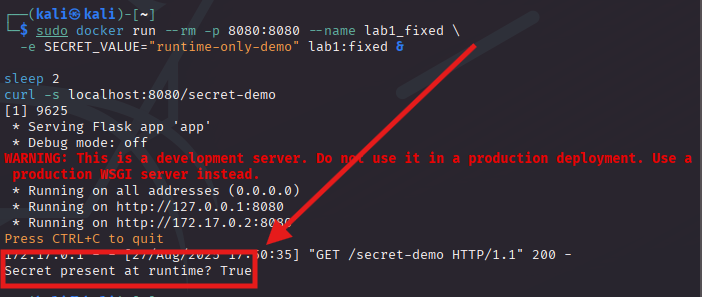

# Part B — Guided Solution & Explanations

*For Lab, check out [lab1.md](./lab1.md)!*

### B1. Create a safe, multi‑stage Dockerfile
Create **Dockerfile** (this is the fixed version):
```dockerfile
# syntax=docker/dockerfile:1
########## Builder stage ##########
FROM python:3.12-slim AS builder
WORKDIR /app


COPY app/requirements.txt ./
RUN pip install --no-cache-dir --prefix=/install -r requirements.txt

########## Runtime stage ##########
FROM python:3.12-slim
ENV PYTHONDONTWRITEBYTECODE=1 \
    PYTHONUNBUFFERED=1 \
    PORT=8080
WORKDIR /app


RUN useradd --create-home --uid 10001 --shell /usr/sbin/nologin appuser


COPY --from=builder /install /usr/local
COPY app/ ./


RUN chown -R appuser:appuser /app
USER 10001

EXPOSE 8080
HEALTHCHECK --interval=30s --timeout=5s --retries=3 CMD python -c "import socket,sys; s=socket.socket(); s.settimeout(2); s.connect(('127.0.0.1', int(__import__('os').getenv('PORT','8080')))); print('ok')" || exit 1

CMD ["python", "app.py"]
```

**Why this is better**
- Pinned base (`python:3.12-slim`) → deterministic, smaller surface.  
- Multi‑stage → build‑time packages stay out of the final image.  
- `--no-cache-dir` → avoids leaving pip caches.  
- Dedicated **non‑root** user with fixed UID → safer, predictable file ownership.  
- No build secrets → sensitive values only via runtime `-e` or a secrets manager.  
- Healthcheck → helps orchestrators detect broken containers.  

>[!TIP]
>
>In larger apps, add a `.dockerignore` tuned to your repo to prevent context bloat and accidental leakage. We created a starter one already.

### B2. Build and run the fixed image

- Build

```bash
sudo docker build -t lab1:fixed .
```



- Run (note the port change and non-root user)

```bash
sudo docker run --rm -p 8080:8080 --name lab1_fixed lab1:fixed
```



In another terminal:

```bash
curl -s localhost:8080/
```



 Expect: Hello from Lab 1!

```bash
curl -s localhost:8080/whoami
```



Expect: EUID != 0 (ex: 10001)

```bash
curl -s localhost:8080/secret-demo
```



 Expect: Secret present at runtime? False

- Pass a runtime secret safely (only for the process lifetime)
```bash
sudo docker stop lab1_fixed >/dev/null 2>&1 || true
```
```bash
sudo docker run --rm -p 8080:8080 --name lab1_fixed \
  -e SECRET_VALUE="runtime-only-demo" lab1:fixed &

sleep 2
curl -s localhost:8080/secret-demo
```



 Expect: Secret present at runtime? True


Stop the container (Ctrl+C) when done.

### B5. Common pitfalls & troubleshooting
- **Flask not installed / pip errors:** Ensure you’re online during `docker build`. Try again with `--no-cache` if caches confuse things.  
- **Port conflicts:** If `8080` (or `5000`) is busy, change the host‑side port: `-p 18080:8080`.  
- **Running as root even after fix:** Check `USER` directive comes **after** all file copies and ownership changes.  
- **Secret still present:** Confirm you built from the **fixed** Dockerfile and that you are not passing `BUILD_SECRET` anywhere.  

---

## Stretch goals (optional, for extra learning)
- Switch the final stage to a **distroless** base and adapt the entrypoint.  
- Add a **gunicorn** production server and demonstrate how to pass configuration via env vars (without leaking).  
- Introduce a **.dockerignore** tuned to a real repo (exclude tests, data dumps, etc.) and measure context size with `docker build --progress=plain`.  
- Add **SBOM** generation (ex: `syft`) and attach it as an artifact.  

---

## Cleanup
```bash
sudo docker rm -f lab1_insecure lab1_fixed 2>/dev/null || true
sudo docker rmi lab1:insecure lab1:fixed 2>/dev/null || true
```

---

