# Lab 2 — cloud\_bucket\_misconfiguration 

> **Goal:** Demonstrate a bucket‑like public misconfiguration using a *local* HTTP server and then remediate it by adding authentication, least privilege access, and encryption‑at‑rest patterns.\

This lab simulates how an object bucket can be accidentally exposed by serving files over HTTP without authentication (mimicking a public cloud bucket). You will discover the exposure, explain its impact, then implement step‑by‑step fixes: restrict access with an API key, avoid storing secrets in plain files, and add basic auditing.


---

## Files & repo layout (what you’ll create)

```
lab2_local/
├─ sensitive_data/
│  └─ credentials.txt
├─ secure/        # files for secure Flask server
   ├─ app.py
   ├─ Dockerfile
   └─ requirements.txt

```

Create the `lab2_local` directory and follow steps below.

---

# Part A — Student Challenge (discover the leak)

### A1. Prepare sensitive content

Create a small test secret in `sensitive_data/credentials.txt`:

```bash
mkdir -p lab2_local/sensitive_data
cat > lab2_local/sensitive_data/credentials.txt <<'EOF'
DB_PASSWORD=UltraSecret123!
API_TOKEN=abcd-1234-SECRET
EOF
ls -l lab2_local/sensitive_data
```

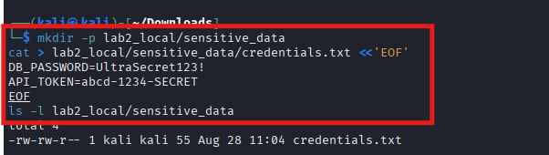

### A2. Launch an insecure public file server (simulates a public bucket)

Use Python’s built‑in simple server to serve the `sensitive_data` directory on port `8000`:

**run locally (no Docker):**

```bash
cd lab2_local/sensitive_data
python3 -m http.server 8000
```

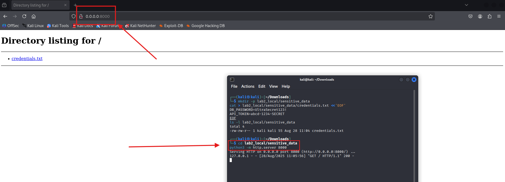

**What this simulates:** a poorly configured object store or static site hosting where files are publicly readable with no auth.

### A3. Demonstrate the leak (anonymous access)

From another terminal (or browser), fetch the file without any credentials:

```bash
curl -v http://localhost:8000/credentials.txt -o /tmp/creds.txt || true
cat /tmp/creds.txt
```

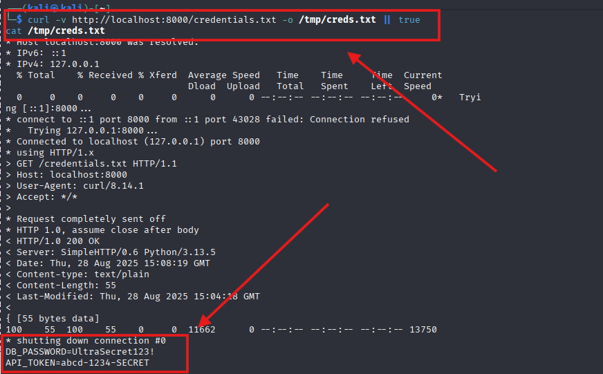

**Expected:** You should see `DB_PASSWORD=UltraSecret123!` printed — proof the file is publicly accessible.

### A4. Enumerate and document

Try listing directory contents (index.html will be auto‑generated by `http.server`):

```bash
curl -s http://localhost:8000/ | sed -n '1,80p'
```

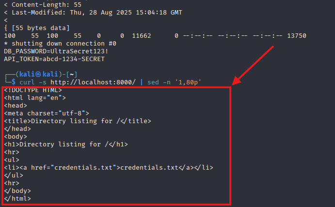

---

# Part B — Solution & Remediation

**Goal:** Replace the insecure server with a minimal authenticated file service that:

- requires a per‑service API key to read objects (mimics scoped credentials),
- does not store secrets in the repo (shows runtime injection),
- writes simple access logs for auditing, and
- optionally demonstrates encryption‑at‑rest by storing files encrypted and decrypting on request.

We'll implement a small Flask app that enforces `X-API-KEY` and logs requests.

### B1. Create secure Flask app (server)

Create [`lab2_local/secure/app.py`(click here for the script)](./app.py):

```python
from flask import Flask, send_from_directory, request, abort
import os
import logging
app = Flask(__name__)
DATA_DIR = os.path.join(os.path.dirname(__file__), '..', 'sensitive_data')
API_KEY = os.environ.get('API_KEY', '')
handler = logging.FileHandler('/tmp/secure_server_access.log')
handler.setLevel(logging.INFO)
app.logger.addHandler(handler)
@app.route('/<path:filename>')
def get_file(filename):
    api_key = request.headers.get('X-API-KEY', '')
    if not API_KEY or api_key != API_KEY:
        app.logger.info(f"DENY {request.remote_addr} {filename} headers={dict(request.headers)}")
        abort(403)
    app.logger.info(f"ALLOW {request.remote_addr} {filename}")
    return send_from_directory(os.path.abspath(DATA_DIR), filename, as_attachment=False)
if __name__ == '__main__':
    app.run(host='0.0.0.0', port=int(os.environ.get('PORT', 8080)))
```

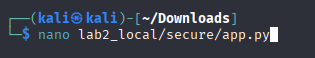

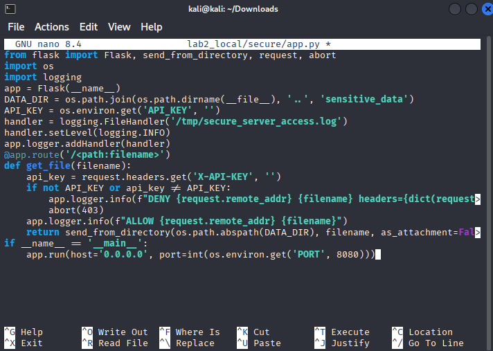

than press `Ctrl+X`, `Y`,`Enter`;

Do the same thing with the following files:

**requirements.txt**

```
Flask==3.0.0
```

**Dockerfile** (lab2\_local/secure/Dockerfile):

```dockerfile
FROM python:3.12-slim
WORKDIR /app
COPY requirements.txt ./
RUN pip install --no-cache-dir -r requirements.txt
COPY app.py ./
CMD ["python", "app.py"]
```

### B2. Build and run the secure server with an API key (in Docker)

From the repository root:


- Build the secure image
```bash
cd lab2_local/secure
sudo docker build -t lab2_secure:latest .
```
- Run the server and inject an API key via env var; mount the sensitive_data dir read-only

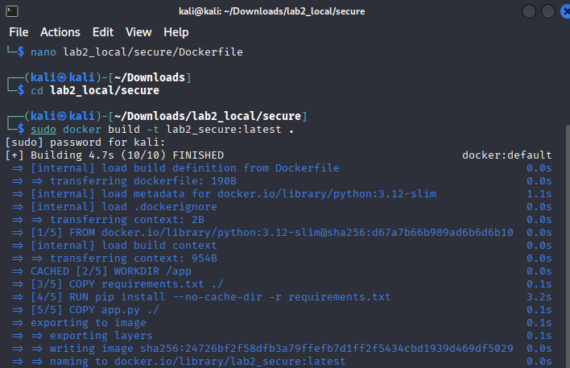

```bash
sudo docker run --rm -p 8080:8080 \
  -e API_KEY="supersecretkey123" \
  -v "$(pwd)/../sensitive_data:/sensitive_data:ro" \
  -w /app lab2_secure:latest
```

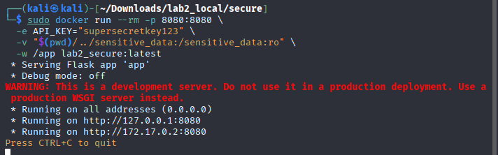

>[!TIP]
>
> If you run without Docker, set `API_KEY` in your environment and `python app.py` inside `secure/` — adjust the `send_from_directory` data dir path accordingly.

### B3. Test the secure server

**Unauthenticated request (should be denied):**

```bash
curl -v http://localhost:8080/credentials.txt -o /tmp/creds_fail.txt || true
ls -l /tmp/creds_fail.txt || true
```

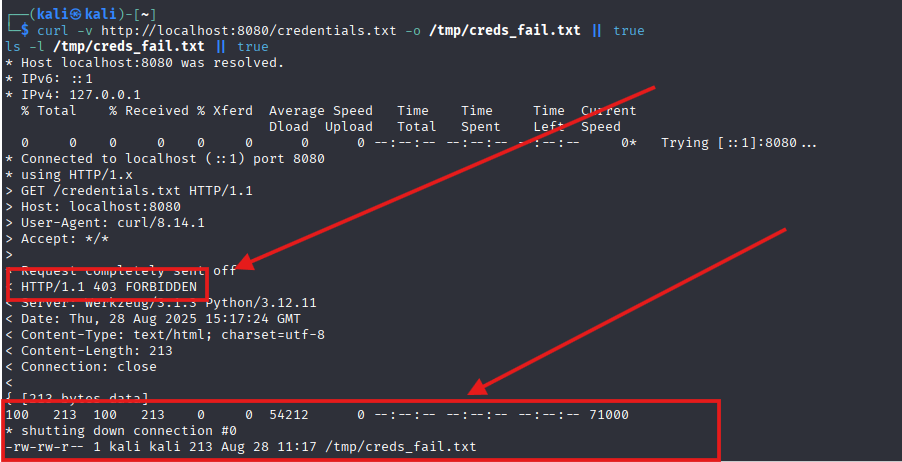


**Authenticated request (should succeed):**

```bash
curl -v -H "X-API-KEY: supersecretkey123" http://localhost:8080/credentials.txt -o /tmp/creds_ok.txt
cat /tmp/creds_ok.txt
```

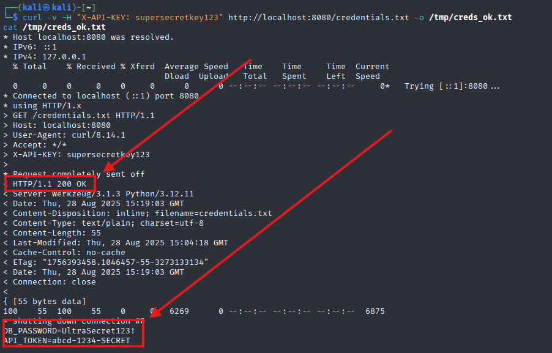

**Check logs**:


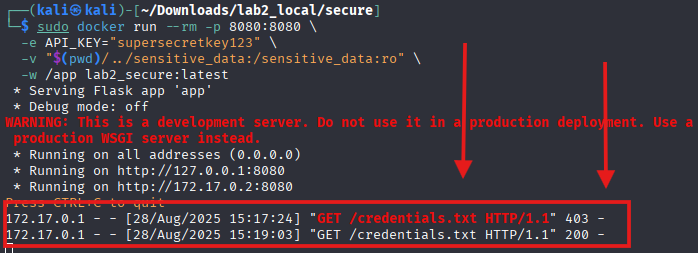


### B4. Improvements & why this fixes the issue

- **Authentication (API key):** prevents anonymous reads; the key can be scoped and rotated.
- **Runtime injection of keys:** The API key is provided via an environment variable (or secrets manager) at process start — not stored in code.
- **Read‑only mount:** Mounting the data folder read‑only prevents the service from modifying sensitive files.
- **Access logging:** Creates an audit trail that can be shipped to a SIEM for detection.
- **Optional encryption‑at‑rest:** Instead of plain files, store encrypted files and decrypt only when authorized (see Optional step B5 below).


## Optional B5 — Demonstrate simple encryption‑at‑rest (client-side) 

This is optional but good to reason about tradeoffs.

**Idea:** Store `credentials.txt.gpg` (GPG‑encrypted using a symmetric passphrase). The secure server decrypts on request using a runtime passphrase (provided via environment variable or via a secrets manager). This prevents plaintext exposure from disk if the storage is read directly (but note: if an attacker compromises the server and reads environment variables or process memory, they can still access the passphrase — so combine with least privilege and process isolation).

Commands (example symmetric encryption):


- On host: create an encrypted artifact

```bash
gpg --symmetric --cipher-algo AES256 --passphrase 'filepass' --batch --yes -o lab2_local/sensitive_data/credentials.txt.gpg lab2_local/sensitive_data/credentials.txt
```

- Remove the plaintext

```bash
shred -u lab2_local/sensitive_data/credentials.txt
```

Modify `app.py` to detect `.gpg` files and run `gpg --decrypt` with the passphrase from an environment variable (use Python subprocess carefully). Keep the passphrase out of source control — inject via runtime secrets.

**Note:** This is a simplified demo. In production prefer provider‑managed KMS/HSM for key management and decryption in a trusted environment.


---

## my other notes & AWS/GCP mapping

- **AWS mapping:** The insecure server maps to an S3 bucket with a public bucket policy or `public-read` ACL. Remediation equivalents: set bucket policy to private, enable Block Public Access at the account level, enable S3 Server Side Encryption with KMS, enable S3 access logging and CloudTrail, create IAM roles with least privilege, and store credentials in Secrets Manager.
- **GCP mapping:** Use Cloud Storage bucket IAM to restrict `allUsers` role; enable CMEK for encryption; 