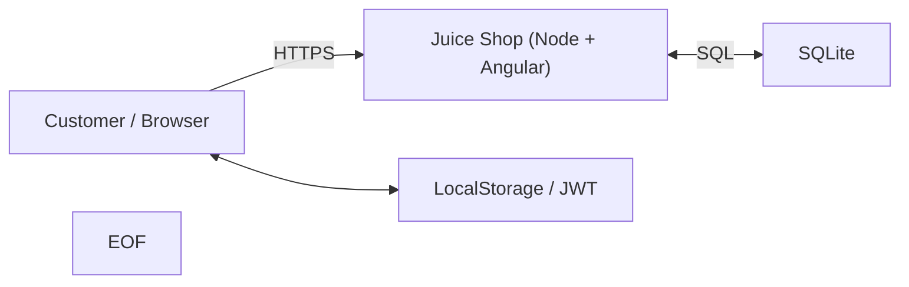

## Goal
Build a **one-page threat model** for a small web app, using **STRIDE**

You’ll draw a quick DFD, identify top risks, rate them, and turn that into a short, actionable mitigation plan

## Setup
```bash
mkdir -p ~/section05-lab1 && cd ~/section05-lab1
```
```bash
sudo apt install docker-ce docker-ce-cli containerd.io docker-buildx-plugin docker-compose-plugin
```
```bash
sudo docker run -d --name juice -p 3000:3000 bkimminich/juice-shop
```

## Start
The app will start on ``http://localhost:3000``


### Sketch the system (DFD
- Make a tiny diagram-as-code so it’s easy to keep in Git

```bash
cat > dfd.md <<'EOF'
# Minimal DFD – Juice Shop (training)

**Elements**
- External Actor: Customer (browser)
- Process: Juice Shop (Angular SPA + Node/Express)
- Data Stores: SQLite (server), LocalStorage (browser)
- Trust Boundary: Browser ↔ Server (Internet)

**Flows**
1. Browser → Server: HTTP(S) requests (login, search, reviews)
2. Server ↔ DB: SQL queries
3. Browser ↔ LocalStorage: JWT/cart cached in browser

> Diagram (Mermaid). GitHub will render this:



You can view and open it via [Github](https://github.com/), or check it out in this repo [here](/coursFiles/Section_05-threatModelingAndReporting/dfd.md)


---
[Back to the section](/courseFiles/Section_05-threatModelingAndReporting/threatModelingAndReporting.md)
