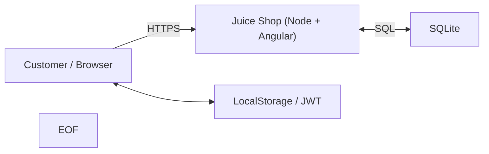

## Goal
Build a **one-page threat model** for a small web app, using **STRIDE**

You’ll draw a quick DFD, identify top risks, rate them, and turn that into a short, actionable mitigation plan

## Setup
```bash
mkdir -p ~/section05-lab1 && cd ~/section05-lab1
```
```bash
sudo apt install docker-ce docker-ce-cli containerd.io docker-buildx-plugin docker-compose-plugin
```
```bash
sudo docker run -d --name juice -p 3000:3000 bkimminich/juice-shop
```

## Start
The app will start on ``http://localhost:3000``


### Sketch the system (DFD
- Make a tiny diagram-as-code so it’s easy to keep in Git

```bash
cat > dfd.md <<'EOF'
# Minimal DFD – Juice Shop (training)

**Elements**
- External Actor: Customer (browser)
- Process: Juice Shop (Angular SPA + Node/Express)
- Data Stores: SQLite (server), LocalStorage (browser)
- Trust Boundary: Browser ↔ Server (Internet)

**Flows**
1. Browser → Server: HTTP(S) requests (login, search, reviews)
2. Server ↔ DB: SQL queries
3. Browser ↔ LocalStorage: JWT/cart cached in browser

> Diagram (Mermaid). GitHub will render this:



You can view and open it via [Github](https://github.com/), or check it out in this repo [here](/courseFiles/Section_05-threatModelingAndReporting/dfd.md)

### Run STRIDE per element (make a small risk table)
Use these prompts while you look at your DFD:

- **Actor:** Spoofing, Repudiation  
- **Process:** Tampering, DoS, Elevation of Privilege  
- **Data Store:** Tampering, Information Disclosure, Repudiation  
- **Cross-boundary Flow:** Info Disclosure, Tampering, DoS

Create a CSV and fill 4–6 concrete risks:

```bash
cat > risks.csv <<'EOF'
Risk,Component,STRIDE,Likelihood,Impact,Severity,Mitigation,Owner,Due
"DOM XSS in search/reviews","Browser↔App (UI)","I/T","H","H","H","Encode output; content rules (CSP); sanitize inputs","@you","2025-09-01"
"Brute force on /login","Auth API","D","H","M","H","Rate limit 5/min/IP; lockout/captcha after threshold","@you","2025-09-05"
"JWT in LocalStorage stolen","Browser Store","I/E","M","H","H","HttpOnly cookies for tokens; short TTL; rotate on privilege change","@you","2025-09-10"
"Password reset user enum","/rest/user/password-reset","I","M","M","M","Uniform responses; rate limit; audit logs","@you","2025-09-08"
"SQL injection in queries","Server↔DB","T/E","M","H","H","Parameterized queries/ORM only; tests","@you","2025-09-15"
EOF
```

View it via
```bash
column -s, -t < risks.csv
```

### Deliverables (what to commit)
- ``dfd.md`` (your one-page system sketch)
- ``risks.csv`` (your top risks with STRIDE tags and owners)

You can also make a ``reflection.md`` with 3 bullets:

- The riskiest **flow** and why
- One thing you’d test next week
- One control you’d propose first

```bash
cat > reflection.md <<'EOF'
- Riskiest flow: ______ because ______.
- Next test: ______ (why).
- First control to ship: ______ (tradeoff: perf/usability/complexity).
EOF
```


---
[Back to the section](/courseFiles/Section_05-threatModelingAndReporting/threatModelingAndReporting.md)
