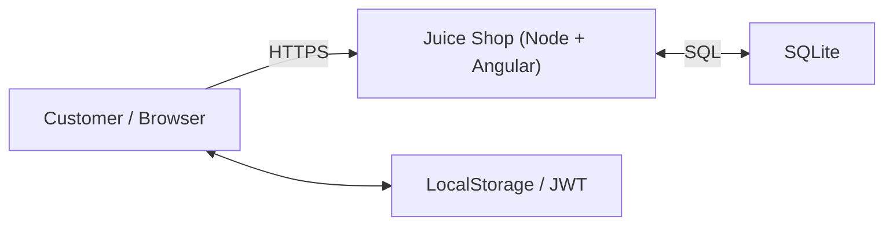

# Minimal DFD – Juice Shop (training)

**Elements**
- External Actor: Customer (browser)
- Process: Juice Shop (Angular SPA + Node/Express)
- Data Stores: SQLite (server), LocalStorage (browser)
- Trust Boundary: Browser ↔ Server (Internet)

**Flows**
1. Browser → Server: HTTP(S) requests (login, search, reviews)
2. Server ↔ DB: SQL queries
3. Browser ↔ LocalStorage: JWT/cart cached in browser

> Diagram (Mermaid). GitHub will render this:

--- 

[Back to Lab1]([Lab 1 – STRIDE Threat Modeling](/courseFiles/Section_05-threatModelingAndReporting/Lab1.md))
